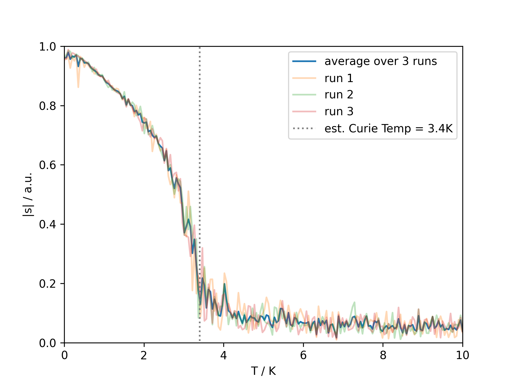
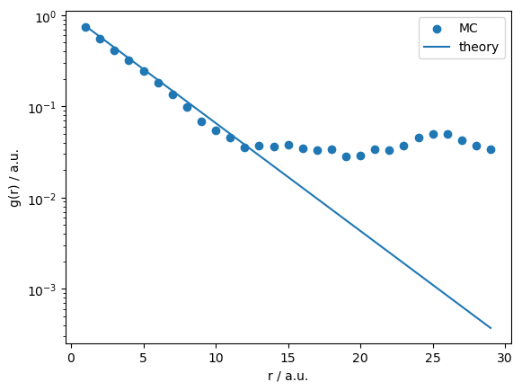

# SIMMER
This <ins>s</ins>tatistical phys<ins>i</ins>cs <ins>sim</ins>ulator using <ins>M</ins>ont<ins>e</ins>-Ca<ins>r</ins>lo algorithm is capable of simulating multiple statistical physics models.

The supported models include
- 1-D Ising model
- Classical Heisenberg model

