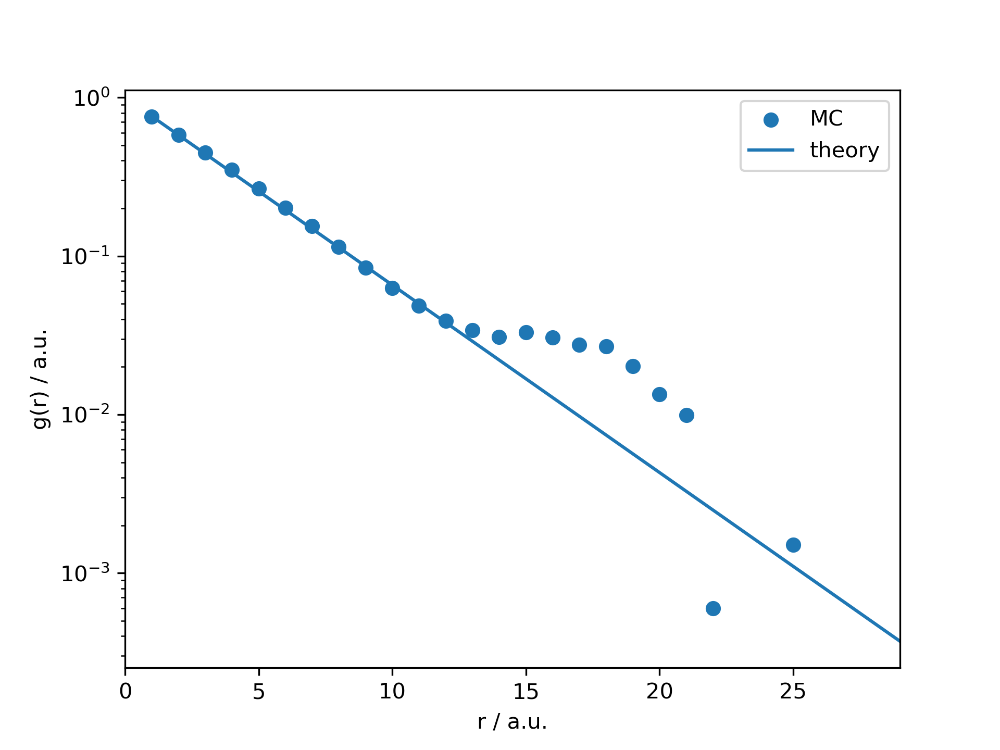

# SIMMER
This *s*tatistical phys**i**cs **sim**ulator using **M**ont**e**-Ca**r**lo algorithm is capable of simulating multiple statistical physics models.

The supported models include
- 1-D Ising model
- Classical Heisenberg model

