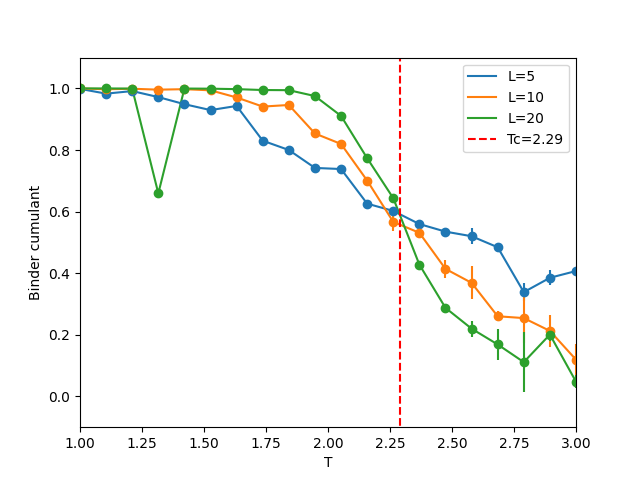
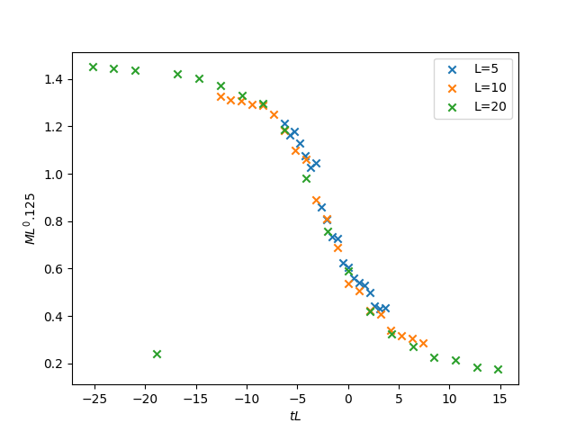

# Simulation of Ising model with Wolff algorithm

We simulated 3000 iterations using wolff algorithm where each iteration
flips one cluster. The resulting Binder cumulant - temperature plot is 

$T_c$ is estimated to be 2.29K (assuming $J=\beta=1$).

Then, we determined $a = 0.125$, $b=1$ to be the scaling exponent of the 2D Ising
model. That is, Ising models of different size $L$ all follows a same curve of
$ML^a = f(tL^b)$ where $t=T-T_c$. The curves are shown below:

